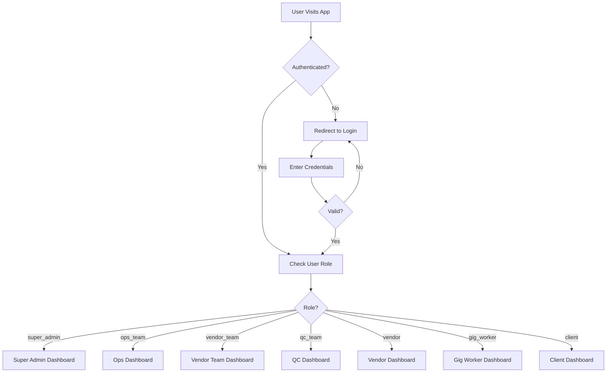
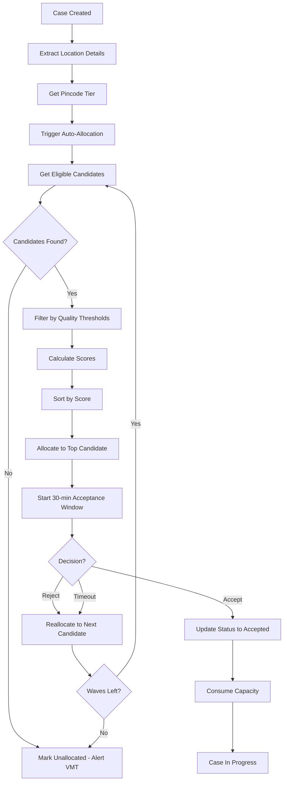
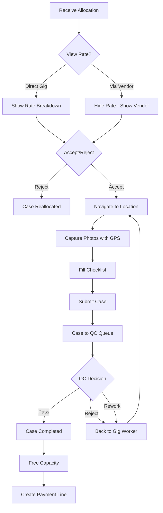
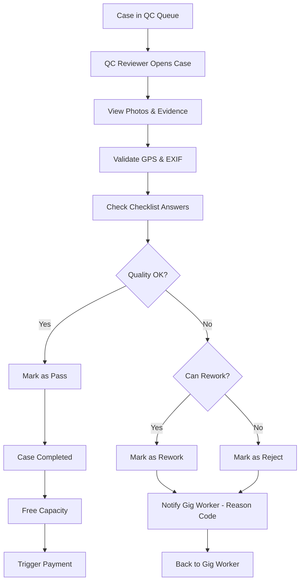
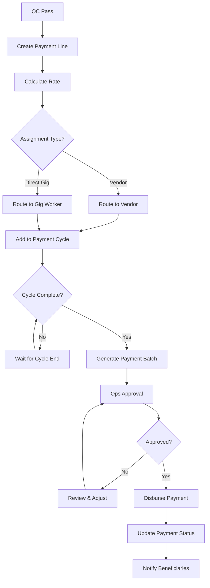
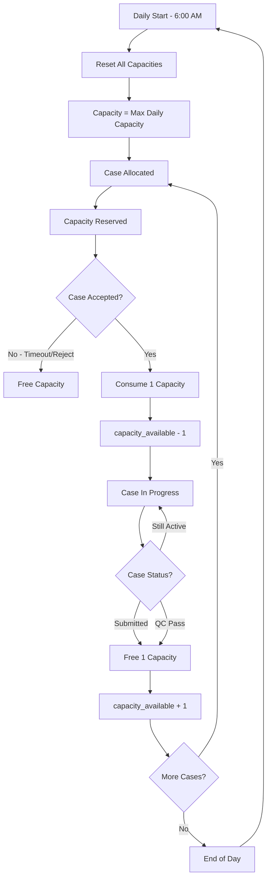

# SecurePath Pro - Background Verification Platform
## Complete Project Analysis & Flow Documentation

---

## 📋 Table of Contents
1. [Project Overview](#project-overview)
2. [Business Objectives](#business-objectives)
3. [System Architecture](#system-architecture)
4. [User Roles & Access Control](#user-roles--access-control)
5. [Core Modules & Features](#core-modules--features)
6. [Application Flow](#application-flow)
7. [Database Architecture](#database-architecture)
8. [Key Workflows](#key-workflows)
9. [Technology Stack](#technology-stack)
10. [Visual Flowchart](#visual-flowchart)

---

## 🎯 Project Overview

**SecurePath Pro** is a comprehensive **Background Verification Platform** designed to manage the complete lifecycle of background verification cases from intake to completion, with a focus on:

- **Intelligent Auto-Allocation**: Capacity-aware, quality-based case assignment
- **Mobile-First Design**: Optimized for field workers (gig workers)
- **Quality Assurance**: Comprehensive QC workflow with GPS and photo validation
- **Dynamic Pricing**: Multi-tier rate card system with bonuses and incentives
- **Financial Management**: Automated payment processing with vendor/direct routing

---

## 🎯 Business Objectives

### Primary Goals
1. **Automate Case Allocation**: Reduce manual assignment through intelligent, capacity-aware allocation
2. **Ensure Quality**: Maintain high verification standards through systematic QC processes
3. **Optimize Field Operations**: Enable efficient mobile-first workflows for gig workers
4. **Streamline Payments**: Automate bi-weekly payment cycles with proper routing
5. **Scale Operations**: Support multiple vendors, clients, and field workers efficiently

### Key Outcomes
- **Reduced TAT (Turn Around Time)**: Faster case completion through optimized allocation
- **Improved Quality**: Quality-based scoring ensures best workers get cases
- **Better Capacity Utilization**: Real-time capacity tracking and management
- **Transparent Operations**: Complete audit trail and real-time monitoring
- **Cost Efficiency**: Dynamic pricing based on location tiers and completion time

---

## 🏗️ System Architecture

### High-Level Architecture

```
┌─────────────────────────────────────────────────────────────┐
│                     FRONTEND LAYER                          │
│  ┌──────────┐  ┌──────────┐  ┌──────────┐  ┌──────────┐   │
│  │  React   │  │ TypeScript│  │ Tailwind │  │ shadcn/ui│   │
│  │  SPA     │  │           │  │   CSS    │  │          │   │
│  └──────────┘  └──────────┘  └──────────┘  └──────────┘   │
└─────────────────────────────────────────────────────────────┘
                            ↕
┌─────────────────────────────────────────────────────────────┐
│                  BACKEND LAYER (Supabase)                   │
│  ┌──────────┐  ┌──────────┐  ┌──────────┐  ┌──────────┐   │
│  │   Auth   │  │ PostgreSQL│  │   Edge   │  │ Real-time│   │
│  │          │  │  Database │  │ Functions│  │ Subscript│   │
│  └──────────┘  └──────────┘  └──────────┘  └──────────┘   │
└─────────────────────────────────────────────────────────────┘
                            ↕
┌─────────────────────────────────────────────────────────────┐
│                  CORE BUSINESS LOGIC                        │
│  • Allocation Engine    • QC Workflow                       │
│  • Capacity Management  • Payment Processing                │
│  • Rate Card System     • Notification System               │
└─────────────────────────────────────────────────────────────┘
```

### Component Architecture

**Frontend Components:**
- `src/components/` - Reusable UI components
- `src/pages/` - Page-level components for different dashboards
- `src/services/` - Business logic and API interactions
- `src/contexts/` - Global state management (Auth)

**Backend (Database):**
- `database/migrations/` - Schema definitions
- `database/functions/` - Business logic functions
- `database/rls/` - Security policies
- `database/test-data/` - Test data and debugging

---

## 👥 User Roles & Access Control

### Role Hierarchy

```
                    ┌─────────────────┐
                    │  SUPER ADMIN    │
                    │  (Full Access)  │
                    └────────┬────────┘
                             │
            ┌────────────────┴────────────────┐
            │                                 │
    ┌───────▼────────┐              ┌────────▼───────┐
    │   OPS TEAM     │              │  VENDOR TEAM   │
    │ (Case Mgmt)    │              │ (Vendor Mgmt)  │
    └───────┬────────┘              └────────┬───────┘
            │                                 │
    ┌───────▼────────┐              ┌────────▼───────┐
    │   QC TEAM      │              │    VENDOR      │
    │ (Quality Check)│              │ (Team Lead)    │
    └────────────────┘              └────────┬───────┘
                                             │
                                    ┌────────▼───────┐
                                    │  GIG WORKER    │
                                    │ (Field Agent)  │
                                    └────────────────┘
                                             
                    ┌────────────────┐
                    │    CLIENT      │
                    │ (View Reports) │
                    └────────────────┘
```

### Role Capabilities

| Role | Platform Access | Primary Functions | Can Create |
|------|----------------|-------------------|------------|
| **Super Admin** | Web | System administration, user management | ops_team, vendor_team, qc_team |
| **Operations Team** | Web | Case creation, client management, allocation oversight | client |
| **Vendor Team** | Web | Vendor onboarding, capacity management | vendor, gig_worker |
| **QC Team** | Web | Quality review, case approval/rejection | - |
| **Vendor** | Web + Mobile | Gig worker management, team assignment | gig_worker |
| **Gig Worker** | Mobile-optimized | Field verification, case execution | - |
| **Client** | Web (Portal) | View cases, download reports | - |

---

## 🔧 Core Modules & Features

### 1. **Case Management System**
- **Manual Case Creation**: Single case entry with all details
- **Bulk Import**: CSV-based bulk case creation
- **Email Intake**: Automated case creation from dedicated inbox (planned)
- **Case Lifecycle Tracking**: Complete status management from creation to closure
- **Priority Management**: High/Medium/Low priority handling
- **TAT Monitoring**: Turn-around-time tracking with SLA alerts

**Key Files:**
- `src/pages/CaseManagement.tsx`
- `src/services/caseService.ts`
- `src/components/CaseManagement/CaseForm.tsx`
- `src/components/CaseManagement/CaseList.tsx`

### 2. **Allocation Engine** ⭐ (Core Feature)

**Intelligence Features:**
- **Capacity-Aware**: Real-time capacity tracking and consumption
- **Quality-Based Scoring**: Multi-factor performance scoring
- **Geographic Matching**: Pincode-based coverage matching
- **Wave-Based Reallocation**: Automatic retry on rejection/timeout

**Scoring Algorithm:**
```javascript
Quality Score (Primary Sort):      Used for ranking (0-1)
Performance Score (Secondary):
  - Completion Rate:        40% weight
  - On-Time Completion:     40% weight  
  - Acceptance Rate:        20% weight
```

**Allocation Flow:**
1. Case created → Get eligible candidates (pincode match + capacity available)
2. Filter by quality thresholds (min quality, completion rate)
3. Calculate scores for all candidates
4. Sort by quality score (primary) and performance score (secondary)
5. Allocate to top candidate
6. Start 30-minute acceptance window
7. On timeout/reject → Reallocate (up to 3 waves)

**Key Files:**
- `src/services/allocationEngine.ts` - Core allocation logic
- `src/services/allocationService.ts` - Allocation operations
- `src/components/Allocation/AllocationDashboard.tsx` - Monitoring UI
- `database/functions/allocation/` - Database functions

### 3. **Capacity Management**

**Real-Time Tracking:**
- Daily capacity per gig worker (configurable max)
- Active case count tracking
- Capacity consumption on case acceptance
- Capacity freeing on case completion/QC pass
- Automatic daily reset at configured time (6:00 AM)

**Capacity States:**
```
Initial Capacity: max_daily_capacity (e.g., 10)
On Allocation:    capacity_available - 0 (pending acceptance)
On Acceptance:    capacity_available - 1 (consumed)
On Submission:    capacity_available + 1 (freed)
Daily Reset:      capacity_available = max_daily_capacity
```

**Key Files:**
- `database/functions/capacity/` - Capacity functions
- `src/services/allocationEngine.ts` - Capacity logic

### 4. **Rate Card System**

**Dynamic Pricing Matrix:**
- **Pincode Tiers**: Tier-1 (Metro), Tier-2 (City), Tier-3 (Rural)
- **Completion Slabs**: 24h, 48h, 72h, 96h+
- **Base Rates**: Per tier-slab combination
- **Adjustments**: Travel allowance, performance bonus, ops overrides

**Rate Calculation:**
```
Final Rate = Base Rate (Tier × Slab) 
           + Travel Allowance 
           + Performance Bonus 
           + Ops Override
```

**Visibility Rules:**
- **Direct Gig Workers**: See full rate breakdown
- **Vendor-Managed Gig Workers**: Rate hidden (payment to vendor)

**Key Files:**
- `src/services/rateCardService.ts`
- `src/pages/RateCardManagement.tsx`
- `src/components/RateCards/RateCalculator.tsx`

### 5. **Quality Control (QC) Workbench**

**QC Workflow:**
1. Field worker submits case with photos and GPS data
2. QC reviewer receives case in queue
3. Review evidence (photos, GPS, EXIF data, answers)
4. Decision: Pass / Reject / Rework
5. On Pass → Case completed, capacity freed, payment triggered
6. On Reject/Rework → Back to field worker with reason codes

**Evidence Validation:**
- **GPS Validation**: Location matching with case address
- **EXIF Data Check**: Photo timestamp and location verification
- **Photo Quality**: Minimum photo count, anti-blur checks
- **Checklist Compliance**: Dynamic form field validation

**Key Files:**
- `src/pages/QCManagement.tsx`
- `src/components/QC/QCWorkbench.tsx`
- `database/migrations/core/20250120000003_quality_control.sql`

### 6. **Payment System**

**Payment Processing:**
- **Bi-Weekly Cycles**: Automated payment cycle creation
- **Routing Logic**: 
  - Vendor cases → Payment to vendor
  - Direct gig cases → Payment to gig worker
- **Adjustments**: Travel, bonus, overrides tracked separately
- **Payment Methods**: Bank transfer, UPI, wallet support

**Payment Lifecycle:**
```
Case Completed → QC Pass → Payment Line Created 
→ Included in Next Cycle → Approval → Disbursement
```

**Key Files:**
- `src/services/paymentService.ts`
- `src/services/payoutCalculationService.ts`
- `database/migrations/core/20250120000004_payment_system.sql`

### 7. **Mobile-Optimized Interface**

**Gig Worker Mobile Features:**
- **Case Acceptance**: One-tap accept/reject
- **Photo Capture**: GPS-tagged photo capture
- **Offline Mode**: Queue submissions, auto-sync when online
- **Navigation**: Deeplink to maps for case location
- **Push Notifications**: Real-time case assignments

**Key Files:**
- `src/components/mobile/GigWorkerMobile.tsx`
- `src/pages/GigWorkerDashboard.tsx`
- `src/pages/GigWorkerAuth.tsx`

### 8. **Notification System**

**Multi-Channel Notifications:**
- **Email**: Case assignments, QC results, payment updates
- **SMS**: Critical alerts and reminders
- **WhatsApp**: Rich media notifications (planned)
- **Push**: Real-time mobile notifications
- **IVR**: Voice calls for urgent alerts (planned)

**Key Events:**
- New allocation → Notify gig worker
- Acceptance timeout → Reminder nudge
- QC result → Notify field worker
- Payment posted → Notify beneficiary
- Capacity low → Alert vendor team

**Key Files:**
- `src/services/notificationService.ts`
- `src/services/emailService.ts`

### 9. **Reporting & Analytics**

**Dashboards:**
- **Ops Dashboard**: Allocation metrics, TAT monitoring, capacity heatmap
- **Vendor Dashboard**: Team performance, capacity utilization
- **QC Dashboard**: Review queue, quality metrics
- **Client Dashboard**: Case status, completion reports

**Key Metrics:**
- Allocation success rate
- Average acceptance time
- TAT adherence percentage
- QC pass rate
- Capacity utilization by region

**Key Files:**
- `src/pages/ReportingDashboard.tsx`
- `src/pages/dashboards/` - Role-specific dashboards

---

## 🔄 Application Flow

### 1. **Authentication Flow**



### 2. **Case Creation & Allocation Flow**



### 3. **Case Execution Flow** (Gig Worker)



### 4. **QC Review Flow**



### 5. **Payment Processing Flow**



### 6. **Capacity Management Flow**



---

## 🗄️ Database Architecture

### Core Tables & Relationships

```
┌─────────────────────────────────────────────────────────────┐
│                    CORE ENTITIES                            │
│                                                             │
│  profiles (users)                                           │
│      ├── gig_partners (field workers)                       │
│      ├── vendors (organizations)                            │
│      ├── clients (customers)                                │
│      └── (ops_team, qc_team, super_admin)                  │
│                                                             │
│  cases (verification tasks)                                 │
│      ├── locations (address & geocoding)                    │
│      ├── case_attachments (files)                          │
│      └── client_contracts (SLA & defaults)                  │
│                                                             │
│  rate_cards (pricing matrix)                               │
│      ├── pincode_tiers (geographic tiers)                  │
│      └── contract_types (case types)                        │
└─────────────────────────────────────────────────────────────┘

┌─────────────────────────────────────────────────────────────┐
│              ALLOCATION & CAPACITY                          │
│                                                             │
│  allocation_logs (allocation history)                       │
│      └── allocation_config (system config)                  │
│                                                             │
│  capacity_tracking (daily capacity)                         │
│      └── performance_metrics (quality scores)               │
└─────────────────────────────────────────────────────────────┘

┌─────────────────────────────────────────────────────────────┐
│              QUALITY CONTROL                                │
│                                                             │
│  submissions (field worker submissions)                     │
│      ├── submission_photos (evidence)                       │
│      └── qc_reviews (QC decisions)                         │
│                                                             │
│  qc_workflow (QC assignment)                               │
│      ├── qc_reason_codes (rejection reasons)               │
│      └── qc_quality_standards (scoring criteria)           │
└─────────────────────────────────────────────────────────────┘

┌─────────────────────────────────────────────────────────────┐
│              PAYMENT SYSTEM                                 │
│                                                             │
│  payment_cycles (bi-weekly cycles)                         │
│      ├── payment_lines (individual payments)               │
│      ├── payment_adjustments (bonuses/travel)              │
│      └── vendor_payouts (vendor payments)                  │
│                                                             │
│  financial_reports (generated reports)                      │
└─────────────────────────────────────────────────────────────┘

┌─────────────────────────────────────────────────────────────┐
│              COMMUNICATION & AUDIT                          │
│                                                             │
│  notifications (multi-channel notifications)                │
│      ├── notification_templates (message templates)         │
│      └── communication_preferences (user prefs)            │
│                                                             │
│  email_intake_logs (email parsing logs)                    │
│  audit_logs (complete audit trail)                         │
│  system_configs (system parameters)                         │
└─────────────────────────────────────────────────────────────┘
```

### Key Database Functions

**Allocation Functions:**
- `get_allocation_candidates()` - Get eligible workers for a case
- `allocate_case_to_candidate()` - Allocate case and update capacity
- `consume_capacity()` - Reduce available capacity
- `free_capacity()` - Increase available capacity
- `update_performance_metrics()` - Update worker quality scores

**Capacity Functions:**
- `initialize_daily_capacity()` - Set up daily capacity tracking
- `reset_daily_capacity()` - Daily reset at 6:00 AM
- `check_capacity_availability()` - Real-time capacity check
- `get_capacity_overview()` - Capacity dashboard data

**Payment Functions:**
- `create_payment_cycle()` - Initialize bi-weekly cycle
- `calculate_payment_lines()` - Calculate all payments for cycle
- `route_payment()` - Determine vendor vs direct routing
- `process_payment_adjustments()` - Apply bonuses/travel

---

## 📊 Key Workflows

### Workflow 1: High-Priority Case (End-to-End)

1. **Intake** (Ops Team)
   - Create case with priority = "high"
   - Add location, client, TAT, description
   - System geocodes address → determines pincode tier

2. **Auto-Allocation** (System)
   - Find candidates covering pincode with capacity > 0
   - Filter by quality thresholds
   - Score all candidates (quality + performance)
   - Allocate to top scorer
   - Send notification to gig worker

3. **Acceptance** (Gig Worker - Mobile)
   - Receive push notification
   - View case details (rate if direct gig)
   - Accept within 30 minutes
   - Capacity consumed (-1)

4. **Field Execution** (Gig Worker - Mobile)
   - Navigate to location
   - Capture minimum 3 photos with GPS
   - Fill verification checklist
   - Submit case

5. **Quality Review** (QC Team - Web)
   - Case appears in QC queue
   - Validate GPS matches address
   - Check EXIF data for authenticity
   - Review photos and answers
   - Mark as "Pass"

6. **Completion** (System)
   - Case status → Completed
   - Free capacity (+1)
   - Create payment line
   - Add to next payment cycle

7. **Payment** (Bi-weekly)
   - Payment cycle includes this case
   - Calculate: Base rate + travel + bonus
   - Route to vendor or direct gig
   - Ops approves batch
   - Disburse payment
   - Send notification

### Workflow 2: Rejection & Reallocation

1. **Initial Allocation**
   - Case allocated to Gig Worker A
   - Notification sent

2. **Rejection**
   - Gig Worker A rejects (reason: "Too far")
   - System logs rejection with reason

3. **Wave 2 Reallocation**
   - Get candidates excluding Worker A
   - Allocate to next best (Worker B)
   - Send notification

4. **Timeout**
   - Worker B doesn't respond in 30 minutes
   - System auto-rejects, logs timeout

5. **Wave 3 Reallocation**
   - Allocate to Worker C
   - Worker C accepts

6. **Case Proceeds**
   - Normal execution flow continues

### Workflow 3: Capacity Exhaustion

1. **Morning Reset** (6:00 AM)
   - All gig workers: capacity = max_daily_capacity (10)

2. **Case Assignments** (9:00 AM - 12:00 PM)
   - Worker A receives 10 cases → capacity = 0
   - Worker B receives 8 cases → capacity = 2

3. **New Case for Worker A's Area** (12:30 PM)
   - Worker A has 0 capacity
   - System skips Worker A
   - Allocates to Worker B (capacity = 2)

4. **Worker A Submits Case** (1:00 PM)
   - Case moves to QC
   - Capacity freed → Worker A capacity = 1

5. **QC Pass** (1:30 PM)
   - No additional capacity change (already freed on submit)
   - Payment line created

6. **New Case** (2:00 PM)
   - Worker A now eligible (capacity = 1)
   - Can receive new allocation

---

## 💻 Technology Stack

### Frontend
- **Framework**: React 18.3.1
- **Language**: TypeScript 5.8+
- **Build Tool**: Vite 5.4
- **Routing**: React Router 6.30
- **State Management**: React Query (TanStack Query 5.83)
- **Styling**: Tailwind CSS 3.4
- **UI Components**: shadcn/ui (Radix UI primitives)
- **Form Handling**: React Hook Form 7.61 + Zod validation
- **Icons**: Lucide React
- **Charts**: Recharts 2.15
- **Date Handling**: date-fns 3.6

### Backend (Supabase)
- **Database**: PostgreSQL 15+
- **Authentication**: Supabase Auth (JWT-based)
- **Real-time**: Supabase Realtime subscriptions
- **Edge Functions**: Deno runtime
- **Storage**: Supabase Storage (S3-compatible)
- **Security**: Row Level Security (RLS) policies

### Database
- **Schema**: 30+ tables with proper relationships
- **Functions**: 50+ database functions (PL/pgSQL)
- **Triggers**: Automatic timestamp, capacity management, audit logging
- **Indexes**: Strategic indexing for performance
- **RLS**: Comprehensive row-level security

### Development Tools
- **Version Control**: Git
- **Package Manager**: npm
- **Linting**: ESLint 9.32
- **Code Quality**: TypeScript strict mode

---

## 🎨 Visual Flowchart

### Complete System Flow Diagram

```
╔══════════════════════════════════════════════════════════════════════╗
║                      SECUREPATH PRO - SYSTEM FLOW                     ║
╚══════════════════════════════════════════════════════════════════════╝

┌─────────────────────────────────────────────────────────────────────┐
│                         1. USER LOGIN                                │
└─────────────────────────────────────────────────────────────────────┘
                                │
                                ├── Super Admin ──→ User Management
                                ├── Ops Team ──────→ Case Management
                                ├── Vendor Team ───→ Vendor Management  
                                ├── QC Team ───────→ QC Workbench
                                ├── Vendor ────────→ Team Dashboard
                                ├── Gig Worker ────→ Mobile Dashboard
                                └── Client ────────→ Reports Portal

┌─────────────────────────────────────────────────────────────────────┐
│                    2. CASE CREATION (Ops Team)                       │
│                                                                      │
│  Manual Entry ──┐                                                   │
│  Bulk CSV ──────┼──→ [Case Created] ──→ Location Geocoded          │
│  Email Intake ──┘                           │                       │
│                                              ↓                       │
│                                    [Determine Pincode Tier]         │
└─────────────────────────────────────────────────────────────────────┘
                                │
                                ↓
┌─────────────────────────────────────────────────────────────────────┐
│              3. AUTO-ALLOCATION ENGINE (Automated)                   │
│                                                                      │
│  ┌──────────────────────────────────────────────────────────┐      │
│  │  Step 1: Get Candidates                                   │      │
│  │    • Coverage: Pincode match                             │      │
│  │    • Capacity: capacity_available > 0                    │      │
│  │    • Status: Active gig workers                          │      │
│  └──────────────────────────────────────────────────────────┘      │
│                          ↓                                          │
│  ┌──────────────────────────────────────────────────────────┐      │
│  │  Step 2: Filter by Thresholds                            │      │
│  │    • Min Quality Score: 30%                              │      │
│  │    • Min Completion Rate: 30%                            │      │
│  │    • Min Acceptance Rate: 30%                            │      │
│  └──────────────────────────────────────────────────────────┘      │
│                          ↓                                          │
│  ┌──────────────────────────────────────────────────────────┐      │
│  │  Step 3: Calculate Scores                                │      │
│  │    Primary:   Quality Score (QC pass rate)               │      │
│  │    Secondary: Performance Score                          │      │
│  │      • Completion Rate:        40%                       │      │
│  │      • On-Time Completion:     40%                       │      │
│  │      • Acceptance Rate:         20%                      │      │
│  └──────────────────────────────────────────────────────────┘      │
│                          ↓                                          │
│  ┌──────────────────────────────────────────────────────────┐      │
│  │  Step 4: Allocate                                        │      │
│  │    • Sort by score (highest first)                       │      │
│  │    • Allocate to top candidate                           │      │
│  │    • Start 30-minute acceptance window                   │      │
│  │    • Send notification                                   │      │
│  └──────────────────────────────────────────────────────────┘      │
└─────────────────────────────────────────────────────────────────────┘
                                │
                                ↓
┌─────────────────────────────────────────────────────────────────────┐
│                  4. CASE ACCEPTANCE (Gig Worker)                     │
│                                                                      │
│  ┌────────────┐                                                     │
│  │ Receive    │──→ View Details ──→ Check Rate* ──→ Decision       │
│  │ Push Notif │                                        │            │
│  └────────────┘                                        │            │
│                                                         │            │
│                         *Rate shown only for direct gigs            │
│                                                                      │
│  Decision: ┌──[Accept]──→ Capacity -1 ──→ Start Execution          │
│           │                                                         │
│           └──[Reject]──→ Reallocate ──→ Try Next Candidate         │
│                          (Wave 2/3)                                 │
└─────────────────────────────────────────────────────────────────────┘
                                │
                                ↓
┌─────────────────────────────────────────────────────────────────────┐
│                  5. FIELD EXECUTION (Gig Worker)                     │
│                                                                      │
│  [Navigate to Location]                                             │
│           ↓                                                         │
│  [Capture Photos with GPS]                                          │
│    • Min 3 photos required                                          │
│    • GPS coordinates captured                                       │
│    • EXIF data embedded                                             │
│           ↓                                                         │
│  [Fill Verification Checklist]                                      │
│    • Dynamic form fields                                            │
│    • Required field validation                                      │
│           ↓                                                         │
│  [Submit Case]                                                      │
│    • Free capacity (+1)                                             │
│    • Case to QC queue                                               │
└─────────────────────────────────────────────────────────────────────┘
                                │
                                ↓
┌─────────────────────────────────────────────────────────────────────┐
│                    6. QUALITY CONTROL (QC Team)                      │
│                                                                      │
│  [Case in QC Queue]                                                 │
│           ↓                                                         │
│  [QC Reviewer Opens Case]                                           │
│           ↓                                                         │
│  [Validate Evidence]                                                │
│    • GPS location match                                             │
│    • EXIF data verification                                         │
│    • Photo quality check                                            │
│    • Checklist completeness                                         │
│           ↓                                                         │
│  [QC Decision]                                                      │
│    ├─[Pass]───→ Case Completed ──→ Trigger Payment                 │
│    ├─[Reject]─→ Log Reason ──→ Back to Gig Worker                  │
│    └─[Rework]→ Log Reason ──→ Back to Gig Worker                   │
└─────────────────────────────────────────────────────────────────────┘
                                │
                                ↓
┌─────────────────────────────────────────────────────────────────────┐
│                 7. PAYMENT PROCESSING (Bi-weekly)                    │
│                                                                      │
│  [QC Pass] ──→ [Create Payment Line]                               │
│                         ↓                                           │
│               [Calculate Amount]                                    │
│                 Base Rate (Tier × Slab)                             │
│                 + Travel Allowance                                  │
│                 + Performance Bonus                                 │
│                 + Ops Override                                      │
│                         ↓                                           │
│               [Route Payment]                                       │
│                 ├─ Vendor Case ──→ Pay Vendor                       │
│                 └─ Direct Gig ───→ Pay Gig Worker                   │
│                         ↓                                           │
│               [Add to Payment Cycle]                                │
│                 • Bi-weekly cycle                                   │
│                 • Multiple payment lines                            │
│                         ↓                                           │
│               [Ops Approval]                                        │
│                         ↓                                           │
│               [Disburse Payment]                                    │
│                 • Bank Transfer / UPI / Wallet                      │
│                         ↓                                           │
│               [Send Notification]                                   │
└─────────────────────────────────────────────────────────────────────┘

┌─────────────────────────────────────────────────────────────────────┐
│                  8. CAPACITY MANAGEMENT (Daily)                      │
│                                                                      │
│  06:00 AM ────→ [Reset All Capacities]                              │
│                  capacity_available = max_daily_capacity            │
│                           ↓                                         │
│  Case Allocated ──→ [Reserve Capacity] (0 change)                  │
│                           ↓                                         │
│  Case Accepted ───→ [Consume Capacity] (-1)                        │
│                           ↓                                         │
│  Case Submitted ──→ [Free Capacity] (+1)                           │
│                           ↓                                         │
│  QC Pass ─────────→ [No Change] (already freed)                    │
│                           ↓                                         │
│  Next Day 06:00 ──→ [Reset Again]                                  │
└─────────────────────────────────────────────────────────────────────┘

┌─────────────────────────────────────────────────────────────────────┐
│                    9. REPORTING & ANALYTICS                          │
│                                                                      │
│  ┌─────────────────┐  ┌─────────────────┐  ┌─────────────────┐    │
│  │  Ops Dashboard  │  │ Vendor Dashboard│  │  Client Portal  │    │
│  ├─────────────────┤  ├─────────────────┤  ├─────────────────┤    │
│  │• Allocation %   │  │• Team Performance│ │• Case Status    │    │
│  │• TAT Monitoring │  │• Capacity Usage │  │• Completion Rate│    │
│  │• QC Pass Rate   │  │• Quality Scores │  │• Download Reports│   │
│  │• Capacity Map   │  │• Payment Summary│  │• SLA Adherence  │    │
│  └─────────────────┘  └─────────────────┘  └─────────────────┘    │
└─────────────────────────────────────────────────────────────────────┘

╔══════════════════════════════════════════════════════════════════════╗
║                            KEY METRICS                                ║
╠══════════════════════════════════════════════════════════════════════╣
║  • Allocation Success Rate:    Track % of successful auto-allocations║
║  • Average Acceptance Time:    Monitor worker response time          ║
║  • TAT Adherence:              Track on-time completion rate         ║
║  • QC Pass Rate:               Quality metric per worker/vendor      ║
║  • Capacity Utilization:       Real-time capacity usage by region    ║
║  • Payment Accuracy:           Track payment processing errors       ║
╚══════════════════════════════════════════════════════════════════════╝
```

---

## 🔐 Security & Access Control

### Row Level Security (RLS)

**Security Layers:**
1. **Authentication**: Supabase Auth with JWT tokens
2. **Authorization**: Role-based access control (RBAC)
3. **Data Isolation**: RLS policies enforce data boundaries
4. **Audit Trail**: Complete logging of all operations

**RLS Policy Examples:**

```sql
-- Gig workers can only see their own cases
CREATE POLICY "gig_workers_own_cases" ON cases
  FOR SELECT
  TO authenticated
  USING (
    current_assignee_id = auth.uid()
    OR current_assignee_id IN (
      SELECT id FROM gig_partners WHERE user_id = auth.uid()
    )
  );

-- Vendors can see their gig workers' cases
CREATE POLICY "vendors_team_cases" ON cases
  FOR SELECT
  TO authenticated
  USING (
    EXISTS (
      SELECT 1 FROM gig_partners gp
      WHERE gp.id = cases.current_assignee_id
      AND gp.vendor_id IN (
        SELECT id FROM vendors WHERE user_id = auth.uid()
      )
    )
  );

-- Ops team can see all cases
CREATE POLICY "ops_all_cases" ON cases
  FOR ALL
  TO authenticated
  USING (
    EXISTS (
      SELECT 1 FROM profiles
      WHERE user_id = auth.uid()
      AND role = 'ops_team'
    )
  );
```

### Data Protection

- **Encryption**: At rest (database) and in transit (TLS)
- **PII Handling**: Sensitive data encrypted/masked
- **File Security**: Signed URLs with expiration
- **GPS Validation**: Spoof detection and verification
- **Photo Integrity**: EXIF validation, watermarking (optional)

---

## 🚀 Deployment & Scalability

### Current Architecture
- **Frontend**: Static hosting (Vercel/Netlify)
- **Backend**: Supabase Cloud
- **Database**: PostgreSQL on Supabase
- **Storage**: Supabase Storage (S3-compatible)

### Scalability Considerations
1. **Database Indexing**: Strategic indexes on high-query columns
2. **Connection Pooling**: PgBouncer for connection management
3. **Caching**: React Query for client-side caching
4. **CDN**: Static assets served via CDN
5. **Horizontal Scaling**: Supabase auto-scaling
6. **Geographic Distribution**: Multi-region deployment (future)

### Performance Optimization
- **Lazy Loading**: Components and routes
- **Code Splitting**: Vite-based chunking
- **Image Optimization**: Compressed uploads
- **Query Optimization**: Efficient database queries
- **Real-time Subscriptions**: Only for critical data

---

## 📈 Future Enhancements (Phase 2)

### Planned Features
1. **AI-Powered Allocation**: Machine learning for better candidate matching
2. **Predictive Analytics**: Capacity forecasting and demand prediction
3. **Client Portal**: Self-service case creation and reporting
4. **API Integration**: RESTful API for external systems
5. **Advanced Reporting**: Custom dashboards and data visualization
6. **Mobile Apps**: Native iOS/Android apps (Capacitor)
7. **Webhook Support**: Real-time integrations with client systems
8. **Multi-Language**: Internationalization support
9. **Advanced QC**: AI-powered photo analysis and fraud detection
10. **WhatsApp Integration**: Rich media notifications

### Scalability Roadmap
1. **Microservices**: Break into specialized services
2. **Message Queue**: Async processing with Redis/RabbitMQ
3. **Caching Layer**: Redis for high-performance caching
4. **Search Engine**: Elasticsearch for advanced search
5. **Data Warehouse**: Analytics with dedicated warehouse

---

## 📊 Success Metrics

### Business KPIs
- **Allocation Efficiency**: > 90% auto-allocation success
- **TAT Compliance**: > 95% cases within TAT
- **Quality Score**: > 90% QC pass rate
- **Worker Utilization**: > 80% capacity utilization
- **Payment Accuracy**: < 1% payment errors

### Technical KPIs
- **System Uptime**: > 99.9% availability
- **API Response Time**: < 200ms average
- **Page Load Time**: < 2s initial load
- **Error Rate**: < 0.1% application errors
- **Database Performance**: < 100ms query time

---

## 🎯 Conclusion

**SecurePath Pro** is a comprehensive, production-ready background verification platform that automates the entire verification workflow with:

✅ **Intelligent Allocation**: Quality-based, capacity-aware auto-allocation  
✅ **Mobile Excellence**: Optimized field worker experience  
✅ **Quality Assurance**: Systematic QC with evidence validation  
✅ **Financial Automation**: Bi-weekly payment processing  
✅ **Real-time Monitoring**: Complete visibility and analytics  
✅ **Scalable Architecture**: Built for growth and performance  

The platform successfully addresses the core challenges of background verification operations:
- **Reduces manual work** through automation
- **Ensures quality** through systematic QC processes
- **Optimizes resources** with capacity-aware allocation
- **Streamlines payments** with automated processing
- **Provides visibility** with comprehensive reporting

---

**Document Version**: 1.0  
**Last Updated**: October 14, 2025  
**Status**: Production Ready  
**Phase**: Phase 1 Complete


